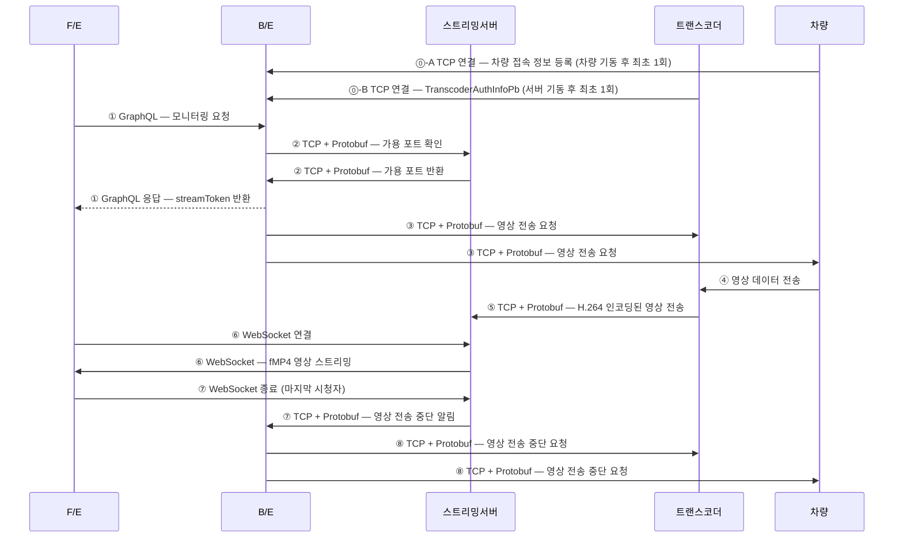

# 스트리밍 서버 연동 인터페이스 정의 V3

## V2 대비 주요 변경점

| 구분                      | V2                             | V3                                        |
| ------------------------- | ------------------------------ | ----------------------------------------- |
| 영상 요청 주체            | F/E → 스트리밍서버 (HTTP POST) | B/E → 스트리밍서버 (TCP + Protobuf)       |
| 트랜스코더/차량 명령 주체 | 스트리밍서버                   | B/E                                       |
| 가용 포트 관리            | 스트리밍서버 자체 관리         | B/E가 스트리밍서버에 확인 후 조율         |
| 영상 중단 흐름            | 스트리밍서버 → 트랜스코더/차량 | 스트리밍서버 → B/E → 트랜스코더/차량      |
| F/E 인증                  | JWT (스트리밍서버가 검증)      | 세션 토큰 (B/E가 발급, 스트리밍서버 전달) |

---

## 전체 흐름



---

## 인터페이스 정의

### ⓪-A 차량 → 관제 B/E : 접속 정보 등록

차량 기동 후 B/E에 TCP 연결하여 최초 1회 자신의 접속 정보를 등록. B/E는 이 정보를 저장하여 ③에서 사용

- **방식**: TCP + Protocol Buffers
- **연결 방향**: 차량 → 관제 B/E (차량이 능동 연결)

```protobuf
syntax = "proto3";

message VehicleRegisterReqPb {
  uint32 vehicleId   = 1;  // 차량 ID
  string vehicleIp   = 2;  // 차량 IP 주소
  uint32 vehiclePort = 3;  // 차량 TCP 수신 포트
}
```

---

### ⓪-B 트랜스코더 → 관제 B/E : 초기 인증 및 포트 등록

트랜스코더 서버 기동 후 관제 B/E에 TCP 연결하여 최초 1회 자신의 정보를 전송. 트랜스코더의 IP와 명령 포트는 환경변수로 고정

- **방식**: TCP + Protocol Buffers
- **연결 방향**: 트랜스코더 → 관제 B/E (트랜스코더가 능동 연결)

```protobuf
syntax = "proto3";

message TranscoderPortPb {
  uint32 externalPort = 1;  // 차량 → 트랜스코더 영상 수신 포트 (외부 노출)
  uint32 internalPort = 2;  // 트랜스코더 내부 처리 포트
}

message TranscoderAuthInfoPb {
  uint32                    id             = 1;  // 트랜스코더 ID
  repeated TranscoderPortPb availablePorts = 2;  // 이용 가능한 포트 리스트
}
```

---

### ① 관제 F/E → B/E : 모니터링 요청

사용자가 특정 차량의 영상 모니터링을 요청. B/E는 ②에서 스트리밍서버로부터 포트를 확보한 뒤 F/E에 `streamToken`을 반환

- **방식**: GraphQL
- **연결 방향**: F/E → B/E

**요청**:

| 필드        | 타입   | 설명    |
| ----------- | ------ | ------- |
| `vehicleId` | string | 차량 ID |

**응답** (②가 완료된 후 반환):

| 필드          | 타입   | 설명                                  |
| ------------- | ------ | ------------------------------------- |
| `streamToken` | string | WebSocket 인증용 세션 토큰 (B/E 발급) |

> 스트리밍서버 URL은 F/E 환경변수로 고정. F/E는 `ws://{스트리밍서버}?token={streamToken}` 형태로 ⑥에서 WebSocket에 연결

---

### ② 관제 B/E ↔ 스트리밍서버 : 가용 포트 확인 및 세션 등록

B/E가 스트리밍서버에 차량의 스트리밍 세션을 등록하고 영상을 수신할 포트를 요청. 스트리밍서버는 가용 포트를 할당하여 반환

- **방식**: TCP + Protocol Buffers
- **연결 방향**: B/E → 스트리밍서버 (B/E가 능동 연결)

**B/E → 스트리밍서버 (요청)**:

```protobuf
syntax = "proto3";

message StreamSessionRequestPb {
  uint32 vehicleId   = 1;  // 차량 ID
  string streamToken = 2;  // F/E WebSocket 인증에 사용될 세션 토큰
}
```

**스트리밍서버 → B/E (응답 및 비동기 알림)**:

스트리밍서버에서 B/E로 오는 모든 메시지는 고정 5바이트 프레임 헤더를 붙여 전송. B/E는 헤더를 먼저 읽어 Protobuf 역직렬화 전에 메시지 타입을 판별

```
[ type: 1 byte ][ length: 4 bytes ][ protobuf payload: N bytes ]
```

| 필드     | 크기    | 설명                                                                        |
| -------- | ------- | --------------------------------------------------------------------------- |
| `type`   | 1 byte  | `0x01` = SESSION_RESPONSE, `0x02` = STOP_NOTIFY                             |
| `length` | 4 bytes | Protobuf 페이로드 바이트 수 (Big-endian). TCP 스트림에서 메시지 경계 구분용 |

```protobuf
syntax = "proto3";

// type = 0x01
message StreamSessionResponsePb {
  uint32 vehicleId     = 1;  // 차량 ID
  uint32 streamingPort = 2;  // 트랜스코더가 H.264 영상을 전송할 포트 (③-A에서 사용)
}
```

---

### ③ 관제 B/E → 트랜스코더 & 차량 : 영상 전송 요청

B/E가 트랜스코더와 차량 양쪽에 동시에 영상 전송을 요청

#### ③-A 관제 B/E → 트랜스코더

차량 영상을 H.264로 인코딩 후 스트리밍서버로 전송하도록 요청. `streamingPort`는 ②에서 스트리밍서버가 반환한 포트

- **방식**: TCP + Protocol Buffers
- **연결 방향**: B/E → 트랜스코더 (환경변수로 설정된 IP/Port 사용)

```protobuf
syntax = "proto3";

message VehicleVideoReqPb {
  uint32 vehicleId     = 1;  // 차량 ID
  uint32 internalPort  = 2;  // 차량 포트 (트랜스코더 측 기존 정의)
  uint32 streamingPort = 3;  // 스트리밍서버 수신 포트 (②에서 반환, 신규 추가)
}
```

#### ③-B 관제 B/E → 차량

트랜스코더로 영상을 전송하도록 요청. 차량이 영상을 전송할 목적지(트랜스코더 IP/Port)를 전달

- **방식**: TCP + Protocol Buffers
- **대상**: `vehicleIp:vehiclePort` (⓪-A에서 저장)

```protobuf
syntax = "proto3";

message VideoRequestPb {
  enum ReqType {
    NONE    = 0;
    REQUEST = 1;
    STOP    = 2;
  }

  ReqType reqType        = 1;
  string  dst_ip_address = 2;  // 트랜스코더 IP
  int32   dst_port       = 3;  // 트랜스코더 수신 포트 (⓪-B의 externalPort)
}
```

> `reqType=REQUEST`로 전송

---

### ④ 차량 → 트랜스코더 : 영상 데이터 전송

③-B 명령 수신 후 차량이 트랜스코더로 원시 영상 데이터를 전송. 전송 프로토콜 및 포맷은 별도 협의

---

### ⑤ 트랜스코더 → 스트리밍서버 : H.264 인코딩된 영상 전송

트랜스코더가 차량 영상을 H.264로 인코딩하여 ③-A에서 전달받은 `streamingPort`로 스트리밍서버에 전송. 스트리밍서버 IP는 트랜스코더 환경변수로 고정

- **방식**: TCP + Protocol Buffers
- **연결 방향**: 트랜스코더 → 스트리밍서버

**프레임 형식:**

```
[ length: 4 bytes Little-endian ][ protobuf payload: N bytes ]
```

| 필드     | 크기    | 설명                                        |
| -------- | ------- | ------------------------------------------- |
| `length` | 4 bytes | Protobuf 페이로드 바이트 수 (Little-endian) |

```protobuf
syntax = "proto3";

message VehicleVideoDataPb {
  uint32 vehicleId  = 1;  // 차량 ID
  bytes  h264Data   = 2;  // H.264 인코딩된 영상 데이터
  uint64 timestamp  = 3;  // 인코딩 타임스탬프 (밀리초)
  uint32 frameSeq   = 4;  // 프레임 순서
  bool   isKeyFrame = 5;  // 프레임이 IDR인지 여부
}
```

---

### ⑥ 관제 F/E ↔ 스트리밍서버 : WebSocket 연결 및 영상 전달

- **방식**: WebSocket + MSE (Media Source Extensions)
- **연결 URL**: `ws://{스트리밍서버}?token={streamToken}`
  - 스트리밍서버 URL은 F/E 환경변수로 고정. `streamToken`은 ①의 GraphQL 응답에서 수신
- **인증**: 스트리밍서버가 `streamToken`을 검증하여 B/E에서 등록된 세션인지 확인 후 vehicleId 식별
- **전송 포맷**: Fragmented MP4 (fMP4) 바이너리
  - 신규 시청자 연결 시: `init segment (ftyp + moov)` + `media segment (moof + mdat)` 함께 전송
  - 이후 프레임: `media segment`만 전송
- **클라이언트**: 브라우저 `MediaSource API`로 수신 즉시 재생

---

### ⑦ F/E → 스트리밍서버 → B/E : 모니터링 종료

마지막 시청자가 WebSocket 연결을 종료하면 스트리밍서버가 B/E에 중단을 알림. B/E는 ⑧ 흐름을 시작

#### ⑦-A F/E → 스트리밍서버

- **방식**: WebSocket 연결 종료

#### ⑦-B 스트리밍서버 → B/E

- **방식**: TCP + Protocol Buffers
- **연결 방향**: ②의 TCP 연결 재사용
- **조건**: 해당 vehicleId를 시청 중인 마지막 시청자가 종료된 경우에만 전송
- **프레임 헤더**: `type=0x02` — ②에서 정의한 프레임 구조 동일하게 사용

```protobuf
syntax = "proto3";

// type = 0x02
message StreamStopNotifyPb {
  uint32 vehicleId = 1;  // 차량 ID
}
```

---

### ⑧ 관제 B/E → 트랜스코더 & 차량 : 영상 전송 중단 요청

B/E가 트랜스코더와 차량 양쪽에 영상 전송 중단을 지시

#### ⑧-A 관제 B/E → 트랜스코더

- **방식**: TCP + Protocol Buffers
- **연결 방향**: B/E → 트랜스코더 (환경변수로 설정된 IP/Port 사용)

```protobuf
syntax = "proto3";

message VehicleVideoStopReqPb {
  uint32 vehicleId     = 1;  // 차량 ID
  uint32 internalPort  = 2;  // 차량 포트 (트랜스코더 측 기존 정의)
  uint32 streamingPort = 3;  // 스트리밍서버 수신 포트 (중단할 세션 식별용)
}
```

#### ⑧-B 관제 B/E → 차량

- **방식**: TCP + Protocol Buffers
- **대상**: `vehicleIp:vehiclePort` (⓪-A에서 저장)
- **메시지**: ③-B의 `VideoRequestPb`와 동일. `reqType=STOP`으로 전송

---

## 포트 요약

| 구간                                          | 프로토콜       | 포트                                        |
| --------------------------------------------- | -------------- | ------------------------------------------- |
| 차량 → 관제 B/E (접속 정보 등록)              | TCP + Protobuf | 협의 필요                                   |
| 트랜스코더 → 관제 B/E (초기 연결)             | TCP + Protobuf | 협의 필요                                   |
| 관제 B/E → 스트리밍서버 (세션 등록/포트 확인) | TCP + Protobuf | 협의 필요                                   |
| 관제 B/E → 트랜스코더 (명령)                  | TCP + Protobuf | 환경변수로 고정                             |
| 관제 B/E → 차량 (명령)                        | TCP + Protobuf | ⓪-A의 `vehiclePort`                         |
| 차량 → 트랜스코더 (영상)                      | 협의 필요      | ⓪-B의 `availablePorts.externalPort`         |
| 트랜스코더 → 스트리밍서버 (H.264 영상)        | TCP + Protobuf | ②에서 스트리밍서버가 반환한 `streamingPort` |
| 스트리밍서버 → 관제 B/E (중단 알림)           | TCP + Protobuf | ②의 TCP 연결 재사용                         |
| 관제 F/E → 스트리밍서버 (WebSocket)           | WebSocket      | 환경변수로 고정                             |

---

## 논의 필요 사항

- 차량 → 트랜스코더 영상 포맷 및 전송 프로토콜 확정
- F/E → B/E 모니터링 요청 GraphQL 스키마 확정
- `availablePorts`의 `externalPort` / `internalPort` 역할 및 할당 방식 확정
- `streamToken` 발급 방식 및 만료 정책
- 트랜스코더 연결 끊김 시 재연결 정책
- 다중 시청자 동시 접속 시 세션 관리 정책
